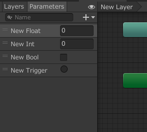
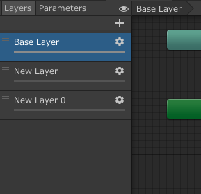
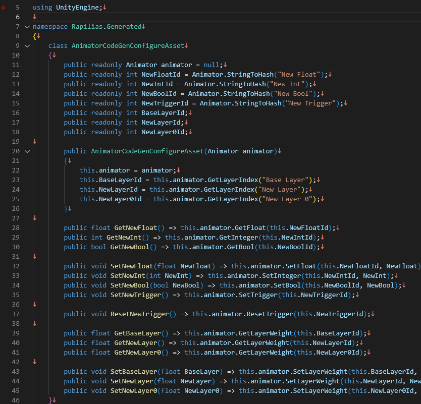

# UnityTypedAnimator

## Images

   
  
↓↓↓↓↓↓↓↓↓↓↓↓↓↓↓↓↓↓↓↓↓↓↓↓↓↓↓↓↓↓↓↓↓↓  
  
  

## Install
```sh
https://github.com/Rapilias/UnityTypedAnimator.git?path=UnityTypedAnimator/Assets/UnityTypedAnimator
```

## Usage
1. Create Configure Assets(RightClick -> Create -> EgoParadise -> [AnimatorCodeGen, AnimatorCodeGenGlobal])  
1. Assigne AnimatorController to AnimatorCodeGenAsset  
1. Assigne AnimatorCodeGenAsset to AnimatorCodeGenGlobalAsset  
1. Click Generate Button  
